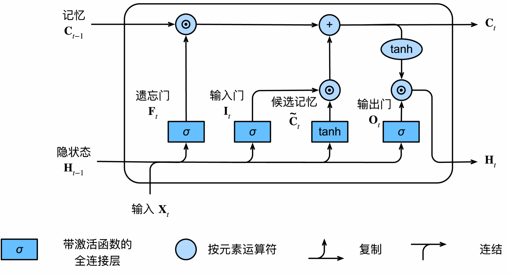
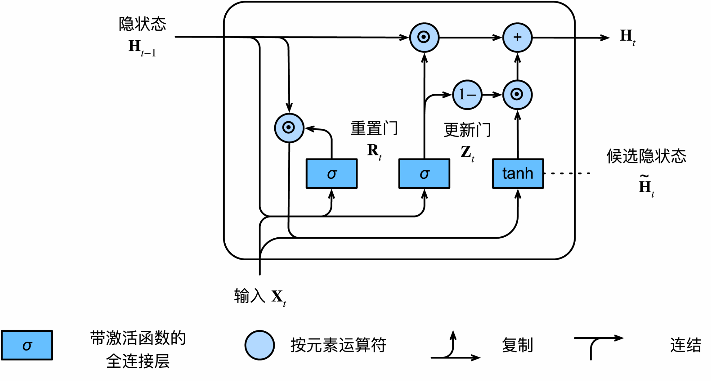

# 循环神经网络

本节将补充循环神经网络（Recurrent Neural Network、RNN）、长短期记忆网络（Long Short-Term Memory、LSTM）、门控循环单元（Gate Recurrent Unit、GRU）等基础知识。

参考：

[人人都能看懂的LSTM](https://zhuanlan.zhihu.com/p/32085405)
[人人都能看懂的GRU](https://zhuanlan.zhihu.com/p/32481747)
[史上最详细循环神经网络讲解（RNN/LSTM/GRU）](https://zhuanlan.zhihu.com/p/123211148)

[动手学深度学习-循环神经网络](https://zh-v2.d2l.ai/chapter_recurrent-neural-networks/)

[动手学深度学习-现代循环神经网络](https://zh-v2.d2l.ai/chapter_recurrent-modern/)

[梯度消失、梯度爆炸问题详解1](https://zhuanlan.zhihu.com/p/76772734)

[梯度消失、梯度爆炸问题详解2](https://zh-v2.d2l.ai/chapter_recurrent-neural-networks/bptt.html)

## 1. 传统的循环神经网络

根据循环神经网络（Recurrent Neural Network，RNN）的基本结构图我们知道：每一个循环层的输入包括来自**当前时间步**的小批量输入 $\mathbf{X}_t$ 和来自**上一个时间步**的隐藏变量（又称**隐状态**） $\mathbf{H}_{t-1}$ 。每一个循环层的输出 $\mathbf{H}_t$ 既作为传递给**下一个时间步**的隐状态，又作为进入输出层的输入，并最终输出变量 $\mathbf{Y}_t$ 。

具体来说，假设有 $h$ 个隐藏单元，批量大小为 $n$ ，输入数为 $d$ 。因此，输入为 $\mathbf{X}_t \in \mathbb{R}^{n \times d}$，前一时间步的隐状态为 $\mathbf{H}_{t-1} \in \mathbb{R}^{n \times h}$ ，输出变量为 $\mathbf{Y}_t \in \mathbb{R}^{n \times q}$ 。数学计算方式如下：

$$
\begin{aligned}
\mathbf{H}_t &= \phi(\mathbf{X}_t \mathbf{W}_{xh} + \mathbf{H}_{t-1} \mathbf{W}_{hh}  + \mathbf{b}_h) \\
\mathbf{Y}_t &= \mathbf{H}_t \mathbf{W}_{hq} + \mathbf{b}_q
\end{aligned}
$$

循环神经网络的参数包括隐藏层的权重
$\mathbf{W}_{xh} \in \mathbb{R}^{d \times h}, \mathbf{W}_{hh} \in \mathbb{R}^{h \times h}$ 和偏置 $\mathbf{b}_h \in \mathbb{R}^{1 \times h}$，以及输出层的权重 $\mathbf{W}_{hq} \in \mathbb{R}^{h \times q}$
和偏置 $\mathbf{b}_q \in \mathbb{R}^{1 \times q}$。

所谓**循环**指的是每个时间步中，我们计算当前时间步的隐状态 $H_t$ 与上一个时间步计算的方式一样，这样就形成了循环计算。由于在**不同的时间步**，RNN使用**同样的模型参数**。因此，网络的参数开销不会随着时间步的增加而增加。由于隐状态的存在，RNN能获得之前时间步的信息，从而可以处理序列数据。

## 2. 长短期记忆神经网络

长短期记忆（Long short-term memory，LSTM）神经网络是一种特殊的RNN。RNN通过隐状态 $\mathbf{H}_t$ 来记录此前时间步的信息。但是由于训练中反向传播的**梯度消失/爆炸问题**（详细请看[梯度消失、梯度爆炸问题详解1](https://zhuanlan.zhihu.com/p/76772734)，
[梯度消失、梯度爆炸问题详解2](https://zh-v2.d2l.ai/chapter_recurrent-neural-networks/bptt.html)），RNN无法很好地处理长序列数据。于是研究者们提出了长短期记忆神经网络来解决这些问题。

相比于传统的RNN只有一个隐状态 $\mathbf{H}_t$，LSTM额外增加了一个记忆元（Memory Cell） $\mathbf{C}_t$ 来传递信息。此外，LSTM还利用门控装置来**选择性地**挑选要记忆的信息（记忆重要的、遗忘不重要的），而RNN则不具备这种能力。这样，LSTM就能很好地处理长序列数据。

LSTM的关键就是这三个门：**遗忘门、输入门和输出门**。他们共同来实现对信息的选择性记忆。它们由三个具有sigmoid激活函数的全连接层处理，以计算输入门、遗忘门和输出门的值。因此，这三个门的值都在 $(0, 1)$ 的范围内。我们用数学公式来进行解释。

假设有 $h$ 个隐藏单元，批量大小为 $n$ ，输入数为 $d$ 。
因此，输入为 $\mathbf{X}_t \in \mathbb{R}^{n \times d}$，
前一时间步的隐状态为 $\mathbf{H}_{t-1} \in \mathbb{R}^{n \times h}$。
相应地，时间步$t$的门被定义如下：
输入门是 $\mathbf{I}_t \in \mathbb{R}^{n \times h}$，
遗忘门是 $\mathbf{F}_t \in \mathbb{R}^{n \times h}$，
输出门是 $\mathbf{O}_t \in \mathbb{R}^{n \times h}$。
它们的计算方法如下：

$$
\begin{aligned}
\mathbf{I}_t &= \sigma(\mathbf{X}_t \mathbf{W}_{xi} + \mathbf{H}_{t-1} \mathbf{W}_{hi} + \mathbf{b}_i)\\
\mathbf{F}_t &= \sigma(\mathbf{X}_t \mathbf{W}_{xf} + \mathbf{H}_{t-1} \mathbf{W}_{hf} + \mathbf{b}_f)\\
\mathbf{O}_t &= \sigma(\mathbf{X}_t \mathbf{W}_{xo} + \mathbf{H}_{t-1} \mathbf{W}_{ho} + \mathbf{b}_o)
\end{aligned}
$$

其中 $\mathbf{W}_{xi}, \mathbf{W}_{xf}, \mathbf{W}_{xo} \in \mathbb{R}^{d \times h}$ 和 $\mathbf{W}_{hi}, \mathbf{W}_{hf}, \mathbf{W}_{ho} \in \mathbb{R}^{h \times h}$ 是权重参数，$\mathbf{b}_i, \mathbf{b}_f, \mathbf{b}_o \in \mathbb{R}^{1 \times h}$ 是偏置参数。

此外，LSTM还设计了一个**候选记忆元**（candidate memory cell）$\tilde{\mathbf{C}}_t \in \mathbb{R}^{n \times h}$ 。它与其余三个门的计算方式类似，只不过用的是 $\text{tanh}$ 作为激活函数，函数值范围为 $(-1, 1)$。

$$\tilde{\mathbf{C}}_t = \text{tanh}(\mathbf{X}_t \mathbf{W}_{xc} + \mathbf{H}_{t-1} \mathbf{W}_{hc} + \mathbf{b}_c)$$

其中 $\mathbf{W}_{xc} \in \mathbb{R}^{d \times h}$ 和  $\mathbf{W}_{hc} \in \mathbb{R}^{h \times h}$ 是权重参数，$\mathbf{b}_c \in \mathbb{R}^{1 \times h}$ 是偏置参数。

在LSTM中，输入门 $\mathbf{I}_t$ 控制采用多少来自候选记忆元 $\tilde{\mathbf{C}}_t$ 的新数据，而遗忘门 $\mathbf{F}_t$ 控制保留多少过去的记忆元 $\mathbf{C}_{t-1} \in \mathbb{R}^{n \times h}$ 的内容。使用**按元素乘法**得到（其实就是一个加权求和过程）：

$$\mathbf{C}_t = \mathbf{F}_t \odot \mathbf{C}_{t-1} + \mathbf{I}_t \odot \tilde{\mathbf{C}}_t$$

其中，符号 $\odot$ 是Hadamard积（按元素乘积）运算符。

>如果输入门始终为 $0$ 而遗忘门始终为 $1$ ，则过去的记忆元 $\mathbf{C}_{t-1}$ 将随时间**完全地**被保存并传递到当前时间步。引入这种设计可以缓解梯度消失问题，并更好地捕获序列中的长距离依赖关系。

输出门 $\mathbf{O}_t$ 被用于计算隐状态 $\mathbf{H}_t$，按元素乘法得到：
$$\mathbf{H}_t = \mathbf{O}_t \odot \tanh(\mathbf{C}_t)$$

这样，LSTM的隐状态 $\mathbf{H}_t$ 的所有元素值都能被保证位于 $(-1, 1)$ 之间。

> $\mathbf{O}_t$ 的元素位于 $(0, 1)$ 之间， $\tanh(\mathbf{C}_t)$ 的元素位于 $(-1, -1)$ 之间。

与传统RNN一致，LSTM最终的输出变量 $\mathbf{Y}_t\in \mathbb{R}^{n \times q} $ 也是由隐状态 $\mathbf{H}_t \in \mathbb{R}^{n \times h}$ 进过一个输出层所得到的：

$$\mathbf{Y}_t = \mathbf{H}_t \mathbf{W}_{hq} + \mathbf{b}_q$$

其中，输出层的权重 $\mathbf{W}_{hq} \in \mathbb{R}^{h \times q}$
和偏置 $\mathbf{b}_q \in \mathbb{R}^{1 \times q}$ 。

## 3. 门控循环单元

作为RNN的变种，门控循环单元（Gate Recurrent Unit、GRU）的输入输出结构与传统RNN一样。输入包括当前时间步的外界输入 $\mathbf{X}_t$ 和来自上一个时间步的隐状态 $\mathbf{H}_{t-1}$ ，输出包括传递给下一个时间步的隐状态 $\mathbf{H}_{t}$ 和 最终经过输出层后的输出 $\mathbf{Y}_t$ 。

为了解决传统RNN的梯度消失/爆炸的问题，LSTM引入了门控装置。GRU在LSTM的基础上进行了简化，在具备同等效果的前提下，计算速度比LSTM更快。

相比LSTM，GRU只有两个门结构，一个是重置门（Reset Gate），一个是更新门（Update Gate）。两个门均是由带有sigmoid激活函数的全连接层给出。接下来我们用数学公式来表达。

依旧假设有 $h$ 个隐藏单元，批量大小为 $n$ ，输入数为 $d$ 。因此，输入为 $\mathbf{X}_t \in \mathbb{R}^{n \times d}$，前一时间步的隐状态为 $\mathbf{H}_{t-1} \in \mathbb{R}^{n \times h}$ ，输出变量为 $\mathbf{O}_t \in \mathbb{R}^{n \times q}$ 。那么重置门 $\mathbf{R}_t \in \mathbb{R}^{n \times h}$ 和 更新门 $\mathbf{Z}_t \in \mathbb{R}^{n \times h}$ 的计算如下所示：

$$
\begin{aligned}
\mathbf{R}_t = \sigma(\mathbf{X}_t \mathbf{W}_{xr} + \mathbf{H}_{t-1} \mathbf{W}_{hr} + \mathbf{b}_r)\\
\mathbf{Z}_t = \sigma(\mathbf{X}_t \mathbf{W}_{xz} + \mathbf{H}_{t-1} \mathbf{W}_{hz} + \mathbf{b}_z)
\end{aligned}
$$

其中 $\mathbf{W}_{xr}, \mathbf{W}_{xz} \in \mathbb{R}^{d \times h}$ 和 $\mathbf{W}_{hr}, \mathbf{W}_{hz} \in \mathbb{R}^{h \times h}$ 是权重参数， $\mathbf{b}_r, \mathbf{b}_z \in \mathbb{R}^{1 \times h}$ 是偏置参数。
> $\mathbf{R}_t$ 和 $\mathbf{Z}_t$ 的计算采用sigmoid作为激活函数，保证值在 $(0, 1)$区间内

与LSTM类似，GRU也引入了一个**候选隐状态** $\tilde{\mathbf{H}}_t \in \mathbb{R}^{n \times h}$。计算方式如下：

$$\tilde{\mathbf{H}}_t = \tanh(\mathbf{X}_t \mathbf{W}_{xh} + \left(\mathbf{R}_t \odot \mathbf{H}_{t-1}\right) \mathbf{W}_{hh} + \mathbf{b}_h)$$

其中 $\mathbf{W}_{xh} \in \mathbb{R}^{d \times h}$ 和 $\mathbf{W}_{hh} \in \mathbb{R}^{h \times h}$ 是权重参数， $\mathbf{b}_h \in \mathbb{R}^{1 \times h}$ 是偏置项。
>$\tilde{\mathbf{H}}_t$ 的计算采用 $\text{tanh}$ 作为激活函数，保证值在 $(-1, 1)$ 区间内

重置门 $\mathbf{R}_t$ 对 上一个时间步的隐状态 $\mathbf{H}_{t-1}$ 进行**选择**。值接近 $1$ 时就保留更多以前的隐状态/信息，值接近 $0$ 时就丢弃以前的隐状态/信息。这样就实现了**重置**隐状态的效果。

同样与LSTM相似，GRU当前时间步输出的隐状态 $\mathbf{H}_t$ 由更新门 $\mathbf{Z}_t$ ，上一个时间步的隐状态 $\mathbf{H}_{t-1}$ 和 当前时间步的**候选隐状态** $\tilde{\mathbf{H}}_t$ 共同计算得到。

$$\mathbf{H}_t = \mathbf{Z}_t \odot \mathbf{H}_{t-1}  + (1 - \mathbf{Z}_t) \odot \tilde{\mathbf{H}}_t$$

每当更新门 $\mathbf{Z}_t$ 接近 $1$ 时，模型就倾向只保留旧状态。此时，来自 $\mathbf{X}_t$ 的信息基本上被忽略，从而有效地跳过了依赖链条中的时间步 $t$ 。相反，当 $\mathbf{Z}_t$ 接近 $0$ 时，
新的隐状态 $\mathbf{H}_t$ 就会接近候选隐状态 $\tilde{\mathbf{H}}_t$ 。

上述的设计，让GRU有了**选择**旧有信息的能力，从而可以帮助我们处理传统RNN中的梯度消失问题，并更好地捕获时间步距离很长的序列的依赖关系。

> 小 tips：

> 重置门有助于捕获序列中的短期依赖关系；

> 更新门有助于捕获序列中的长期依赖关系。

与传统RNN一致，GRU最终的输出变量 $\mathbf{Y}_t\in \mathbb{R}^{n \times q} $ 也是由隐状态 $\mathbf{H}_t \in \mathbb{R}^{n \times h}$ 进过一个输出层所得到的：

$$\mathbf{Y}_t = \mathbf{H}_t \mathbf{W}_{hq} + \mathbf{b}_q$$

其中，输出层的权重 $\mathbf{W}_{hq} \in \mathbb{R}^{h \times q}$
和偏置 $\mathbf{b}_q \in \mathbb{R}^{1 \times q}$ 。

## 反向传播中的梯度消失和梯度爆炸问题