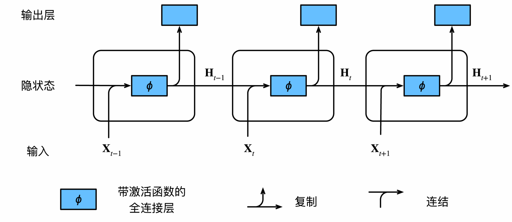

# 循环神经网络

本节将补充循环神经网络（Recurrent Neural Network、RNN）、长短期记忆网络（Long Short-Term Memory、LSTM）、门控循环单元（Gate Recurrent Unit、GRU）等基础知识。

参考：

[人人都能看懂的LSTM](https://zhuanlan.zhihu.com/p/32085405)
[人人都能看懂的GRU](https://zhuanlan.zhihu.com/p/32481747)
[史上最详细循环神经网络讲解（RNN/LSTM/GRU）](https://zhuanlan.zhihu.com/p/123211148)

[动手学深度学习-循环神经网络](https://zh-v2.d2l.ai/chapter_recurrent-neural-networks/)

[动手学深度学习-现代循环神经网络](https://zh-v2.d2l.ai/chapter_recurrent-modern/)

## 1. 传统的循环神经网络

根据循环神经网络（Recurrent Neural Network，RNN）的基本结构图我们知道。每一个循环层的输入包括来自**当前时间步**的小批量输入 $X_t$和来自**上一个时间步**的隐藏变量（又称**隐状态**） $H_{t-1}$ 。每一个循环层的输出包括 通往输出层的 $O_t$ 和 传递给**下一个时间步**的隐状态 $H_t$ 。

用公式表达就是：

$H_t = \phi(X_t W_{xh} + H_{t-1} W_{hh} + b_h)$ 

$O_t = H_{t} W_{hy} + b_y$

所谓**循环**指的是每个时间步中，我们计算当前时间步的隐状态 $H_t$ 与上一个时间步计算的方式一样，这样就形成了循环计算。由于在不同的时间步，循环神经网络使用**同样的模型参数**。因此，循环神经网络的参数开销不会随着时间步的增加而增加。

## 2. 长短期记忆网络

## 3. 门控循环单元